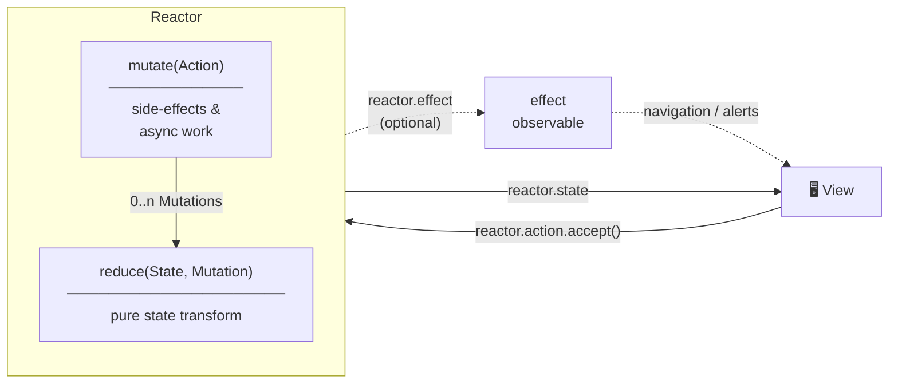

# RxReactor
[](https://central.sonatype.com/search?q=com.gyurigrell.rxreactor) 

[](https://github.com/ggrell/RxReactor/actions/workflows/merge_master.yml)

[](https://codecov.io/gh/ggrell/RxReactor)

[](https://jitpack.io/com/github/ggrell/RxReactor/rxreactor1/main-SNAPSHOT/javadoc/) 

[](https://jitpack.io/com/github/ggrell/RxReactor/rxreactor2/main-SNAPSHOT/javadoc/) 

[](https://jitpack.io/com/github/ggrell/RxReactor/rxreactor3/main-SNAPSHOT/javadoc/)

RxReactor is a Kotlin framework for a reactive and unidirectional RxJava-based application architecture. 
This repository introduces the basic concept of RxReactor and describes how to build an application 
using it. It is available to using with Kotlin on any JVM as well as Android.

## Usage

RxReactor combines the **Flux** pattern with **reactive programming** to create a unidirectional data flow architecture. Every view has a corresponding reactor that manages its state; the view sends actions to the reactor and observes the state stream for updates. There is no business logic in the view layer.



### Basic Concepts

There are three core types defined inside a reactor:

| Type | Description |
|------|-------------|
| `Action` | Represents a user interaction or event (sealed class) |
| `Mutation` | Represents an atomic state change (sealed class, internal to the reactor) |
| `State` | The immutable snapshot of the view's state (data class) |

Data flows in one direction:

1. The **view** sends an `Action` to `reactor.action`
2. `mutate(action)` converts the action into 0..n `Mutation`s — this is where side-effects like network calls live
3. `reduce(state, mutation)` applies each mutation to the current state, returning a new `State` — this is a pure function
4. The **view** observes `reactor.state` and re-renders

### Implementing a Reactor

Extend `Reactor<Action, Mutation, State>` and provide `mutate()` and `reduce()` implementations:

```kotlin
class CounterReactor : Reactor<CounterReactor.Action, CounterReactor.Mutation, CounterReactor.State>(
    initialState = State()
) {
    sealed class Action {
        object Increment : Action()
        object Decrement : Action()
    }

    sealed class Mutation {
        object IncreaseValue : Mutation()
        object DecreaseValue : Mutation()
    }

    data class State(
        val value: Int = 0
    )

    override fun mutate(action: Action): Observable<Mutation> = when (action) {
        is Action.Increment -> Observable.just(Mutation.IncreaseValue)
        is Action.Decrement -> Observable.just(Mutation.DecreaseValue)
    }

    override fun reduce(state: State, mutation: Mutation): State = when (mutation) {
        is Mutation.IncreaseValue -> state.copy(value = state.value + 1)
        is Mutation.DecreaseValue -> state.copy(value = state.value - 1)
    }
}
```

`mutate()` is the right place for async work. Each emission from the returned `Observable` is passed to `reduce()` in order:

```kotlin
override fun mutate(action: Action): Observable<Mutation> = when (action) {
    is Action.LoadData ->
        apiService.fetchData()
            .map { Mutation.SetData(it) }
            .startWith(Mutation.SetLoading(true))
            .concatWith(Observable.just(Mutation.SetLoading(false)))
}
```

### Binding the View

A view subscribes to `reactor.state` and pushes user events into `reactor.action`:

```kotlin
private fun bind(reactor: CounterReactor) {
    // Actions: view → reactor
    incrementButton.clicks()
        .map { CounterReactor.Action.Increment }
        .subscribe(reactor.action)
        .addTo(disposeBag)

    decrementButton.clicks()
        .map { CounterReactor.Action.Decrement }
        .subscribe(reactor.action)
        .addTo(disposeBag)

    // State: reactor → view
    reactor.state
        .map { it.value.toString() }
        .distinctUntilChanged()
        .subscribe(counterLabel::setText)
        .addTo(disposeBag)
}
```

You can also push actions directly for non-reactive events:

```kotlin
reactor.action.accept(CounterReactor.Action.Increment)
```

### Effects (Side-Effects that Don't Change State)

For one-time events like navigation or showing an error dialog, use `ReactorWithEffects`. It adds an `effect` observable that the view can subscribe to independently from state:

```kotlin
class LoginReactor(
    private val contactService: ContactService,
    initialState: State = State()
) : ReactorWithEffects<LoginReactor.Action, LoginReactor.Mutation, LoginReactor.State, LoginReactor.Effect>(
    initialState
) {
    sealed class Action {
        data class UsernameChanged(val username: String) : Action()
        data class PasswordChanged(val password: String) : Action()
        object Login : Action()
    }

    sealed class Mutation {
        data class SetUsername(val username: String) : Mutation()
        data class SetPassword(val password: String) : Mutation()
        data class SetBusy(val busy: Boolean) : Mutation()
    }

    sealed class Effect {
        data class ShowError(val message: String) : Effect()
        object NavigateToHome : Effect()
    }

    data class State(
        val username: String = "",
        val password: String = "",
        val isBusy: Boolean = false
    )

    override fun mutate(action: Action): Observable<Mutation> = when (action) {
        is Action.UsernameChanged -> Observable.just(Mutation.SetUsername(action.username))
        is Action.PasswordChanged -> Observable.just(Mutation.SetPassword(action.password))
        is Action.Login -> login()
    }

    override fun reduce(state: State, mutation: Mutation): State = when (mutation) {
        is Mutation.SetUsername -> state.copy(username = mutation.username)
        is Mutation.SetPassword -> state.copy(password = mutation.password)
        is Mutation.SetBusy    -> state.copy(isBusy = mutation.busy)
    }

    private fun login(): Observable<Mutation> =
        authService.login(currentState.username, currentState.password)
            .flatMap<Mutation> { success ->
                if (success) emitEffect(Effect.NavigateToHome)
                else emitEffect(Effect.ShowError("Invalid credentials"))
                Observable.just(Mutation.SetBusy(false))
            }
            .startWith(Mutation.SetBusy(true))
}
```

Bind effects in the view alongside state:

```kotlin
reactor.effect
    .subscribe { effect ->
        when (effect) {
            is LoginReactor.Effect.ShowError   -> showSnackbar(effect.message)
            is LoginReactor.Effect.NavigateToHome -> startActivity(Intent(this, HomeActivity::class.java))
        }
    }
    .addTo(disposeBag)
```

### SimpleReactor

When your actions map directly to state changes with no intermediate mutation type, use `SimpleReactor`. It uses `Action` as `Mutation`, so you only need to implement `reduce()`:

```kotlin
class ToggleReactor : SimpleReactor<ToggleReactor.Action, ToggleReactor.State>(
    initialState = State()
) {
    sealed class Action {
        object Toggle : Action()
    }

    data class State(val isOn: Boolean = false)

    override fun reduce(state: State, mutation: Action): State = when (mutation) {
        is Action.Toggle -> state.copy(isOn = !state.isOn)
    }
}
```

### Advanced: Transform Methods

The three `transform*` methods let you modify the action, mutation, or state streams before they are processed. A common Android use case is `transformState()` to ensure state emissions happen on the main thread:

```kotlin
override fun transformState(state: Observable<State>): Observable<State> =
    state.observeOn(AndroidSchedulers.mainThread())
```

The Android-specific subclasses (`AndroidReactor`, `AndroidReactorWithEffects`) apply this automatically.

Use `transformMutation()` to merge global event streams into the reactor's mutation pipeline:

```kotlin
// Merge an app-wide network status stream into every reactor that cares about connectivity
override fun transformMutation(mutation: Observable<Mutation>): Observable<Mutation> =
    Observable.merge(mutation, networkStatus.map { Mutation.SetNetworkAvailable(it) })
```

### Testing

Because the reactor is completely independent of the view, it can be tested by sending actions to the relay and asserting on the emitted states:

```kotlin
@Test
fun `incrementing increases value by 1`() {
    val reactor = CounterReactor()
    val observer = reactor.state.test()

    reactor.action.accept(CounterReactor.Action.Increment)

    observer.assertValueAt(1) { it.value == 1 }
}
```

## Download

Releases are published to Maven Central, and individual archives are also available in the 
[Releases](https://github.com/ggrell/RxReactor/releases) for the project.

```groovy
subprojects {
    repositories {
        mavenCentral()
    }
}
```

Add this repository to have access to Maven Central snapshots:
```groovy
subprojects {
    repositories {
        maven {
            url 'https://oss.sonatype.org/content/repositories/snapshots/'
            mavenContent { snapshotsOnly() }
        }
    }
}
```

For RxJava 1:
```groovy
compile 'com.gyurigrell.rxreactor:rxreactor1:1.0.0' // Add -SNAPSHOT for snapshot versions
compile 'com.gyurigrell.rxreactor:rxreactor1-android:1.0.0' // Optional, add -SNAPSHOT for snapshot versions
```
or for RxJava 2:
```groovy
compile 'com.gyurigrell.rxreactor:rxreactor2:1.0.0' // Add -SNAPSHOT for snapshot versions
compile 'com.gyurigrell.rxreactor:rxreactor2-android:1.0.0' // Optional, add -SNAPSHOT for snapshot versions
```
or for RxJava 3:
```groovy
compile 'com.gyurigrell.rxreactor:rxreactor3:1.0.0' // Add -SNAPSHOT for snapshot versions
compile 'com.gyurigrell.rxreactor:rxreactor3-android:1.0.0' // Optional, add -SNAPSHOT for snapshot versions
```

## Demo Projects

The repo currently contains a simple login test app with lookup of existing emails on the device.
The `LoginViewModel` handles loading on-device email addresses for lookup as the user is typing.

## Contributing

TBD

## License

[BSD 3-Clause License](https://github.com/ggrell/RxReactor/blob/master/LICENSE)

## Credits

Port of https://github.com/ReactorKit/ReactorKit to Kotlin
